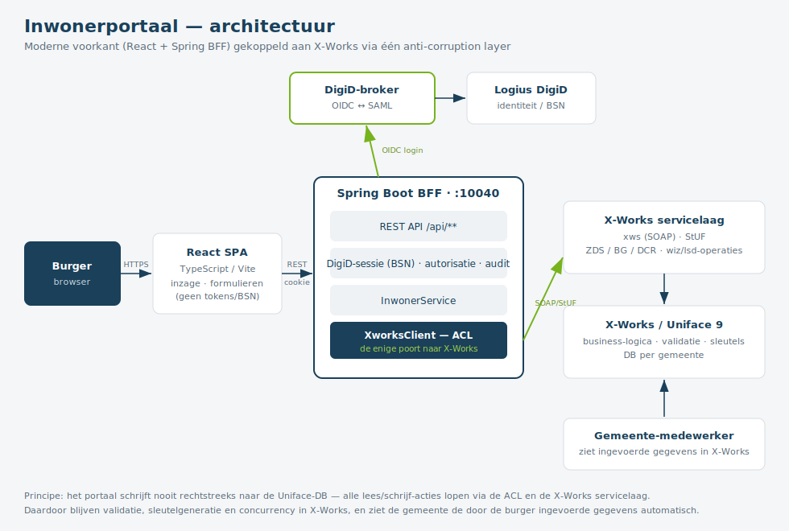
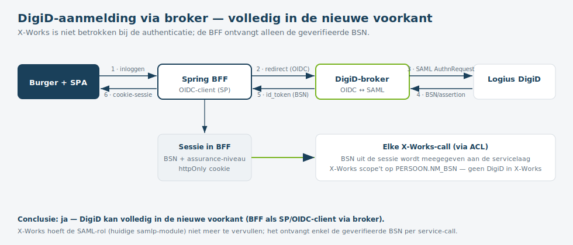

# Inwonerportaal — opzet, architectuur & X-Works-integratie

> Versie 0.1 · demo-opzet · Stipter / Verius
> Moderne herbouw van het X-Works "klantenportaal" (Uniface 9 + XSLT/XRIA) naar **Java 17 / Spring Boot** (backend-for-frontend) + **React / TypeScript / Vite**, gekoppeld aan X-Works via één anti-corruption layer.

## 1. Doel en uitgangspunten

Het inwonerportaal geeft een burger toegang tot zijn **eigen** gegevens en laat hem **aanvragen indienen**. De gemeente blijft in X-Works werken; daarom moeten de door de burger ingevoerde gegevens in X-Works terechtkomen.

Kern-uitgangspunten:

1. **Eén poort naar X-Works** — alle koppeling loopt via een anti-corruption layer (ACL). De rest van het portaal kent X-Works niet.
2. **Nooit rechtstreeks naar de Uniface-database schrijven.** Schrijven gebeurt via de X-Works *servicelaag*, zodat business-logica, validatie, sleutelgeneratie en concurrency in X-Works blijven — en de gemeente de ingevoerde gegevens automatisch ziet.
3. **Dynamisch uit X-Works.** Vragenlijsten/formulieren worden niet hard ingebouwd maar uit X-Works opgehaald (de `VRAGENLIJSTTEMPLATE` per gemeente).
4. **DigiD ontkoppeld van X-Works** (zie hoofdstuk 6).

## 2. Architectuuroverzicht



| Laag | Technologie | Verantwoordelijkheid |
|---|---|---|
| **Frontend (SPA)** | React, TypeScript, Vite | Presentatie: inzageschermen, dynamische formulieren. Houdt géén tokens of BSN vast; alleen een sessie-cookie. |
| **Backend-for-Frontend (BFF)** | Java 17, Spring Boot | REST-API voor de SPA, DigiD-sessie, autorisatie, audit, en de ACL naar X-Works. Draait op **poort 10040**. |
| **Anti-corruption layer (ACL)** | `XworksClient` (interface) | De enige poort naar X-Works. Twee implementaties: `stub` (in-memory demo) en `xworks` (echte servicelaag-koppeling). |
| **X-Works servicelaag** | xws (SOAP), StUF (ZDS/BG/DCR), `wiz`/`lsd`-operaties | Ontsluit X-Works-functionaliteit als services. |
| **X-Works / Uniface 9** | Uniface + DB per gemeente | Business-logica, validatie, opslag. Onveranderd. |

De BFF is een klassiek **BFF-pattern**: de SPA praat alleen met de BFF (zelfde origin, cookie-sessie), de BFF praat met X-Works en de DigiD-broker. Dat houdt geheimen en de BSN aan de serverkant.

## 3. Anti-corruption layer (ACL)

De interface `nl.verius.inwonerportaal.acl.XworksClient` definieert alle lees- en schrijf-acties. Elke methode is in de demo geïmplementeerd door `XworksClientStub`; de echte koppeling komt in `XworksSoapClient` (profiel `xworks`).

Voordeel van deze opzet: de frontend, de REST-API en de domeinlogica zijn volledig losgekoppeld van het X-Works-transport (SOAP/StUF). De koppeling kan stap voor stap echt gemaakt worden zonder de rest aan te raken.

## 4. Portaal-API (frontend ↔ BFF)

De endpoints die de React-frontend gebruikt. Alle endpoints werken op de **ingelogde burger** (BSN uit de sessie).

| Methode + pad | Functie | X-Works-handeling (zie §5) |
|---|---|---|
| `GET /api/persoon` | Eigen persoonsgegevens (inzage) | lsd-persoon |
| `GET /api/zaken` | Eigen zaken/dossiers (inzage) | lsd-zaken / ZDS |
| `PUT /api/persoon/contactgegevens` | Contactgegevens wijzigen | CONTACTGEGEVENS save |
| `GET /api/aanvragen/catalogus` | Beschikbare vragenlijsten | query VRAGENLIJSTTEMPLATE |
| `GET /api/aanvragen/definities/{type}` | Template van een vragenlijst | wiz-vltmpl00-getocc |
| `POST /api/aanvragen?type=…` | Aanvraag starten (concept) | vragenlijst start |
| `GET /api/aanvragen/{id}` | Aanvraag ophalen | vragenlijst getocc |
| `POST /api/aanvragen/{id}/evaluatie` | Regelevaluatie (validatie/berekening) | vragenlijst-eval |
| `PUT /api/aanvragen/{id}/concept` | Concept opslaan | vragenlijst-save |
| `POST /api/aanvragen/{id}/bijlagen` | Bijlage toevoegen | dropzone-verwerk / DCR |
| `DELETE /api/aanvragen/{id}/bijlagen/{bijlageId}` | Bijlage verwijderen | removeAttachedFile |
| `POST /api/aanvragen/{id}/indienen` | Aanvraag indienen | vragenlijst-submit → zak-saveWizard |
| `POST /api/aanvragen/{id}/ondertekenen` | Indienen met DigiD-ondertekening | vragenlijst-signDigiD |
| `DELETE /api/aanvragen/{id}` | Aanvraag afbreken | vragenlijst-abort |

## 5. Benodigde X-Works-endpoints (BFF/ACL ↔ X-Works)

Dit zijn de X-Works-operaties die de echte koppeling (`XworksSoapClient`) moet aanroepen. Transport: de **`xws` SOAP-adapter** (`xws-adapter00`, `xws-soapWrap/Unwrap`, `xws-extractOperationWSDL`) en/of **StUF** (ZDS voor zaken, BG voor persoon, DCR voor documenten). De operatienamen `xria-wiz_*` / `lsd-*` zijn afkomstig uit de X-Works XSLT-resources.

| # | Portaal-functie | X-Works-operatie / StUF-bericht | Richting | Entiteit(en) |
|---|---|---|---|---|
| 1 | Persoonsgegevens inzien | `lsd-persoon` getocc (of StUF-BG `npsLv01/La01` voor BRP) | **lezen** | PERSOON, ADRES, CONTACTGEGEVENS, BANKREKENING |
| 2 | Zaken/dossiers inzien | StUF-ZDS `ZDS0120-beantwoordVraag` / ZKN-bevraging | **lezen** | ZAAK (ZKN) |
| 3 | Vragenlijst-catalogus | query/index over `VRAGENLIJSTTEMPLATE` (per `ADMINISTRATION`) | **lezen** | VRAGENLIJSTTEMPLATE |
| 4 | Vragenlijst-definitie | Uniface **vltmpl-getocc**-operatie (achter `wiz-vltmpl00-getocc.xslt`) | **lezen** | VRAGENLIJSTTEMPLATE, PAGINA, VRAAGBOOM, SVRAAG, TAG_* |
| 5 | Aanvraag starten | `xria-wiz_vrgnlijst00-vragenlijst` (start/addocc) | **schrijven** | VRAGENLIJST |
| 6 | Regelevaluatie | `xria-wiz_vrgnlijst00-vragenlijst-eval` | **lezen/berekenen** | VRAGENLIJST (server-side regels) |
| 7 | Concept opslaan | `xria-wiz_vrgnlijst00-vragenlijst-save` | **schrijven** | VRAGENLIJST (`SC_XMLDATA`) |
| 8 | Rij toevoegen/verwijderen | `vragenlijst-addocc` / `vragenlijst-remocc` | **schrijven** | VRAGENLIJST-occurrences |
| 9 | Contactgegevens wijzigen | CONTACTGEGEVENS save (`showTransactionOnInput`) | **schrijven** | CONTACTGEGEVENS |
| 10 | Bijlage toevoegen/verwijderen | `vragenlijst-dropzone-verwerk` / `removeAttachedFile`; document via StUF-DCR (`startDocumentcreatie_Di02`) | **schrijven** | DOCUMENT / bijlage |
| 11 | Aanvraag indienen | `xria-wiz_vrgnlijst00-vragenlijst-submit` → `xria-zs_zak00-zak-saveWizard` | **schrijven** | VRAGENLIJST → ZAAK |
| 12 | Ondertekenen met DigiD | `xria-wiz_vrgnlijst00-vragenlijst-signDigiD` | **schrijven** | VRAGENLIJST (ondertekend) |
| 13 | Aanvraag afbreken | `xria-wiz_vrgnlijst00-vragenlijst-abort` | **schrijven** | VRAGENLIJST |

### Terugschrijven naar X-Works

De schrijf-acties (5–13) gaan **niet** rechtstreeks op de tabellen, maar roepen bestaande X-Works-operaties aan. Concreet voor indienen (#11): `vragenlijst-submit` valideert en `zak-saveWizard` maakt er een **zaak** van. Daarmee:

- genereert X-Works zelf het zaaknummer en de sleutels;
- gelden alle Uniface-triggers, validaties en de `_crc`/`_status`-concurrency;
- verschijnt de aanvraag direct in de werkomgeving van de **gemeente-medewerker**.

> **Belangrijke nuance over `wiz-vltmpl00-getocc`:** dit is **geen SOAP/REST-endpoint**, maar een
> **XSLT-transformatie** die de beheer-/onderhoudsweergave van een vragenlijst-template (de pagina's)
> naar METRO-UI rendert. De daadwerkelijke ophaalactie is de **Uniface `getocc`-operatie** erachter,
> die het onderliggende "XML Form document" produceert. Voor de moderne koppeling consumeer je dat
> XML-document (de template-data), **niet** de METRO-UI-HTML — en die operatie moet eerst als service
> ontsloten worden (xws SOAP / StUF / een REST-wrapper). Zie het aparte ontwerp `xworks-template-service.md`.

> **Aandachtspunt:** of de bestaande `xws`/StUF-laag al deze operaties al als service ontsluit, of dat er enkele Uniface-operaties bijgebouwd moeten worden, is de grootste open vraag. Dit moet in een discovery-spike met de X-Works-leverancier worden vastgesteld (zie ook de migratie-analyse in de kennisrepo).

## 6. DigiD-aanmelding via een broker — zonder X-Works



**Vraag:** kan de DigiD-aanmelding volledig in de nieuwe voorkant gebeuren, via een broker, zonder X-Works?

**Antwoord: ja.** DigiD-authenticatie staat los van X-Works. In de huidige situatie is X-Works zélf de SAML Service Provider (de `samlp`-module). In de nieuwe architectuur neemt de **BFF** die rol over — bij voorkeur via een **DigiD-broker**.

### Waarom een broker

Aansluiten op Logius DigiD vraagt SAML-metadata, certificaten, een security-assessment en ketentests. Een broker (bijv. Logius-routeringsvoorziening, of een commerciële broker zoals Signicat / Connectis / iWelcome, of een gemeentelijke IAM-voorziening) neemt die last weg en biedt de BFF een eenvoudig **OIDC**-koppelvlak:

- **Upstream** praat de broker SAML met Logius DigiD.
- **Downstream** is de BFF een **OIDC-client** (Spring Security OAuth2/OIDC).

### Flow (zie diagram)

1. Burger klikt "Inloggen" in de SPA → BFF.
2. BFF redirect naar de broker (OIDC authorization request).
3. Broker doet de DigiD/SAML-afhandeling met Logius.
4. Logius levert de geverifieerde identiteit (BSN) terug aan de broker.
5. Broker geeft de BFF een `id_token` met de BSN (+ assurance-niveau).
6. BFF zet een **httpOnly cookie-sessie**; de SPA is ingelogd.

Vanaf dat moment haalt de BFF bij **elke** X-Works-call de BSN uit de sessie en geeft die mee aan de ACL. X-Works scope't daarop (`PERSOON.NM_BSN`) — precies zoals nu, maar zonder dat X-Works de authenticatie doet.

### Gevolgen

- De huidige `samlp`-module in X-Works is **niet meer nodig** voor het portaal.
- "Volledig in de voorkant" = in de **BFF + SPA** (het BFF-pattern). De SPA zelf is een public client en mag geen tokens beheren; daarom doet de BFF de OIDC-afhandeling en sessie. Dat is de veilige invulling van "in de voorkant", niet in de browser-only.
- Uitbreidbaar zonder X-Works: **eHerkenning** (voor organisaties) en **DigiD Machtigen** (namens iemand inloggen) lopen via dezelfde broker; de BFF krijgt dan naast de BSN ook de gemachtigde-context.
- **Assurance-niveau** (DigiD Basis/Midden/Substantieel/Hoog) komt uit het token en kan per actie worden afgedwongen in de BFF (bijv. ondertekenen vereist een hoger niveau).

## 7. Beveiliging, autorisatie en audit

- **Sessie**: httpOnly, secure cookie; CSRF-bescherming op muterende endpoints; korte sessieduur + single logout naar de broker.
- **Autorisatie**: de BFF dwingt af dat de ingelogde BSN alleen zijn eigen gegevens en aanvragen ziet/wijzigt. (In de demo zit dit nog in de stub; in productie deels in de BFF en deels via de scoping door X-Works.)
- **Audit**: de BFF logt wie (BSN) welke mutatie wanneer deed — los van X-Works, zodat inzage- en mutatiegedrag herleidbaar is.
- **Gegevensminimalisatie**: de SPA krijgt alleen de velden die nodig zijn; de BSN blijft serverside.

## 8. Deployment

Eén Docker-container; de React-build wordt door Spring Boot als statische bestanden geserveerd. Frontend en `/api` op dezelfde origin, poort **10040**.

```powershell
docker compose up -d --build      # bouwen + starten
# open http://localhost:10040
docker compose down               # stoppen
```

Profiel `stub` (standaard) draait zonder X-Works/DigiD met testdata. Profiel `xworks` schakelt over naar de echte koppeling (endpoint-config via environment-variabelen).

## 9. Status en vervolgstappen

**Werkend in de demo (profiel `stub`):** inzage persoon/zaken, contactgegevens wijzigen, dynamische vragenlijsten uit de (gesimuleerde) template incl. catalogus, generieke regelevaluatie, bijlagen, indienen → zaak, DigiD-ondertekening, afbreken. Stipter-huisstijl.

**Te doen voor productie:**

1. **Discovery-spike**: de X-Works-operaties uit §5 verifiëren tegen de echte `xws`/StUF-laag; ontbrekende operaties met de leverancier afstemmen.
2. **`XworksSoapClient`** implementeren (begin met `getPersoon` en `getVragenlijstDefinitie` via de Uniface vltmpl-getocc-operatie — zie `xworks-template-service.md`).
3. **DigiD via broker** aansluiten (OIDC-client in de BFF) — hoofdstuk 6.
4. **Autorisatie & audit** productierijp maken.
5. Eventueel de **regelevaluatie** (`vragenlijst-eval`) volledig delegeren aan X-Works i.p.v. de generieke nabootsing in de stub.

---
*Gerelateerd: de analyses in de kennisrepo `wiki/synthesis/xworks-burger-inzageportaal.md` (inzage-keten) en `wiki/synthesis/xworks-partner-medeondertekening-digid.md` (DigiD-ondertekening, story 14408).*
